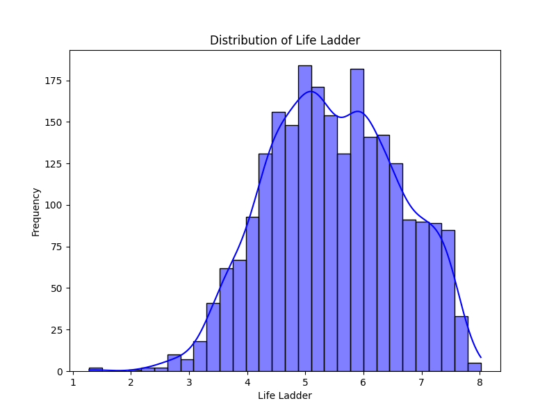
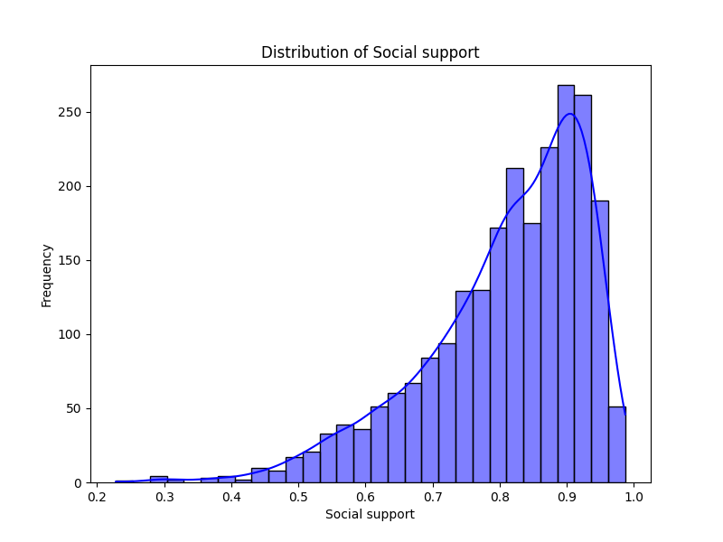

# Automated Analysis Report

## Dataset Overview
- **Rows**: 2363
- **Columns**: 11
- **Missing Values**:
Country name                          0
year                                  0
Life Ladder                           0
Log GDP per capita                   28
Social support                       13
Healthy life expectancy at birth     63
Freedom to make life choices         36
Generosity                           81
Perceptions of corruption           125
Positive affect                      24
Negative affect                      16

## Key Insights
LLM analysis failed.

## Visualizations
### Correlation Matrix

### Distributions

